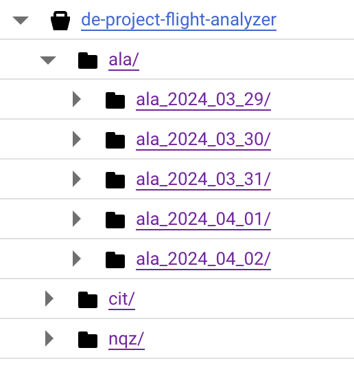
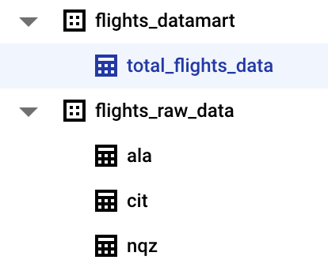
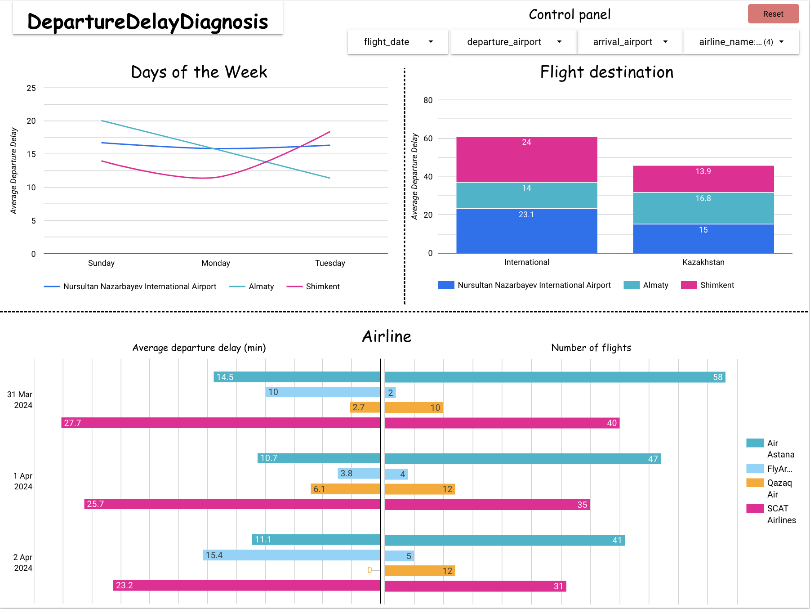

# DepartureDelayDiagnosis

[Link to the dashboard](https://lookerstudio.google.com/reporting/a3e131ab-435c-452c-89d1-ec205d9e11c5)

Welcome to the "DepartureDelayDiagnosis" Data Engineering project, focusing on analyzing and addressing departure delays in three cities of republican significance in Kazakhstan: Astana (NQZ), Almaty (ALA), and Shymkent (CIT).

Analyzing departure delays enables the identification of patterns and trends, optimizing operational efficiency, and enhancing customer experience. It informs resource allocation, ensures regulatory compliance, and facilitates competitive analysis among airlines. Moreover, it aids in route planning and optimization strategies to minimize delays and enhance overall airline performance.

This project utilizes data provided by the [Aviation Stack website](https://aviationstack.com/).

## Architecture

## Strategy 
1. **Data Upload**: Utilize a [data load tool](https://dlthub.com/) to upload data from the Aviation Stack API to Google Cloud Storage daily.

  
2. **Data Transformation and Loading**: Extract data from Google Cloud Storage, transform it, and load it into separate tables within a raw data dataset in Google BigQuery.
  
3. **Data Integration**: Combine all relevant data, perform necessary cleaning, and load it into a data mart dataset within Google BigQuery.

4. **Visualization and Analysis**: Showcase analytical statistics and visualizations regarding departure delays through a Google Studio Looker dashboard. ([link](https://lookerstudio.google.com/reporting/a3e131ab-435c-452c-89d1-ec205d9e11c5))

By executing these steps, the project aims to provide insights into departure delays in the specified cities and facilitate informed decision-making for mitigating delays and improving passenger experiences.

## Tools
1. CI/CD: GitHub Actions
2. IaC: Terraform
3. Orchestration: Google Cloud Composer (Apache Airflow)
4. Data Lake: Google Cloud Storage
5. Data Warehouse: Google BigQuery
6. Data Ingestion (batch): Python, Data Load Tool
7. Visualization: Google Looker Studio

## Reproducibility
1. Run the main Terraform file (in the Terraform directory) with all the set configurations for initiating the Google Clou Platform (Composer, GCS, BQ).
2. Use the [`ci_cd.yml`](.github/workflows/ci_cd.yml) file inside the `.github/workflow` directory to set up CI/CD with your GitHub repository and Google Composer.
3. Upload the DAG and utility Python scripts located in the `dag` directory to your repository.