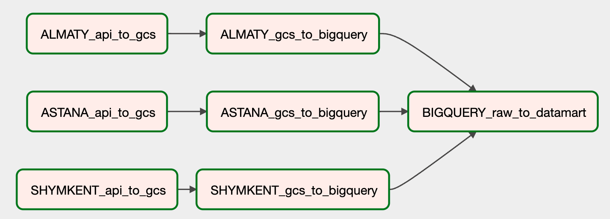

# DepartureDelayDiagnosis

[Link to the dashboard](https://lookerstudio.google.com/reporting/a3e131ab-435c-452c-89d1-ec205d9e11c5)  
[YouTube demo video](https://youtu.be/yMKLz_SAqw4?si=mwCZvA6qNBiYPKp0)

Welcome to the "DepartureDelayDiagnosis" Data Engineering project, focusing on analyzing and addressing departure delays in three cities of republican significance in Kazakhstan: Astana (NQZ), Almaty (ALA), and Shymkent (CIT).

Analyzing departure delays enables the identification of patterns and trends, optimizing operational efficiency, and enhancing customer experience. It informs resource allocation, ensures regulatory compliance, and facilitates competitive analysis among airlines. Moreover, it aids in route planning and optimization strategies to minimize delays and enhance overall airline performance.

The objective is to leverage information obtained from the [Aviation Stack website](https://aviationstack.com/) for examining various factors potentially associated with departure delays. This investigation will encompass the day of the week of departure, destination, and the airline. The project intends to fetch data in **batches daily** through the specified API, execute necessary data transformations, and present the findings on a dashboard, as outlined in the architecture below.

## Architecture

## Strategy 
1. **Data Upload**: Utilize a [data load tool](https://dlthub.com/) to upload data from the Aviation Stack API to Google Cloud Storage daily.

  
2. **Data Transformation and Loading**: Extract data from Google Cloud Storage, transform it, and load it into separate tables within a raw data dataset in Google BigQuery.
  
3. **Data Integration**: Combine all relevant data, perform necessary cleaning, and load it into a data mart dataset within Google BigQuery.

4. **Visualization and Analysis**: Showcase analytical statistics and visualizations regarding departure delays through a Google Studio Looker dashboard. ([link](https://lookerstudio.google.com/reporting/a3e131ab-435c-452c-89d1-ec205d9e11c5))

## Flight ETL Workflow

The Flight ETL workflow for this project is structured around a series of tasks, which are categorized into three main segments:
1. Transfer from API to Google Cloud Storage (specific to each city).
2. Movement from Google Cloud Storage to Google BigQuery (specific to each city).
3. Processing from raw data in BigQuery to a unified BigQuery datamart (applicable across all cities).

**Idempotency** within each task is maintained through the application of incremental loading strategies, including merging and replacing operations.

## Tools
1. **CI/CD**: GitHub Actions
2. **IaC**: Terraform
3. **Orchestration**: Google Cloud Composer (Apache Airflow)
4. **Data Ingestion (batch)**: Python, Data Load Tool
5. **Data Lake**: Google Cloud Storage
6. **Data Warehouse**: Google BigQuery
7. **Visualization**: Google Looker Studio

## Setting Up a Project for Flight Data Analysis
1. **Project Creation on Google Cloud Platform (GCP):**
   - Tip: Consider creating a new Gmail account to take advantage of the $300 free trial offer.
2. **Register on Aviation Stack to Obtain API Key:**
   - Note: The free tier of the API allows for 100 data points per request and a total of 100 requests per month. For my needs, involving data collection from three cities, I set up three separate free accounts.
3. **Execute the Terraform Configuration:**
   - Run the [`main.tf`](terraform/main.tf) file located in the Terraform directory. This script configures necessary services on GCP, including Cloud Composer, Google Cloud Storage (GCS), and BigQuery (BQ).
4. **Set Up Continuous Integration/Continuous Deployment (CI/CD):**
   - Use the [`ci_cd.yml`](.github/workflows/ci_cd.yml) file found in the `.github/workflows` directory to integrate CI/CD processes with your GitHub repository and Google Cloud Composer.
5. **Deploy Data Processing Scripts:**
   - Use the Directed Acyclic Graphs (DAGs) and the utility Python scripts from the [`dag`](dags/) folder to your repository for data orchestration and analysis.